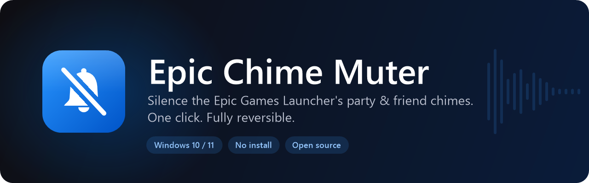
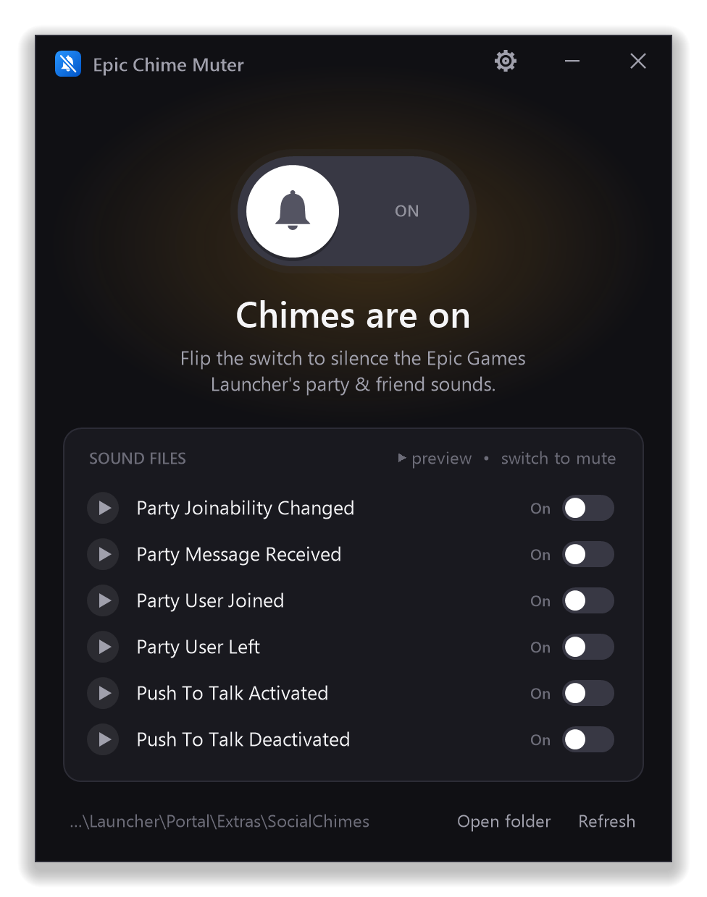
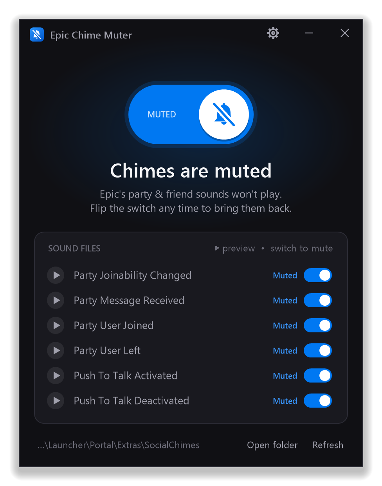
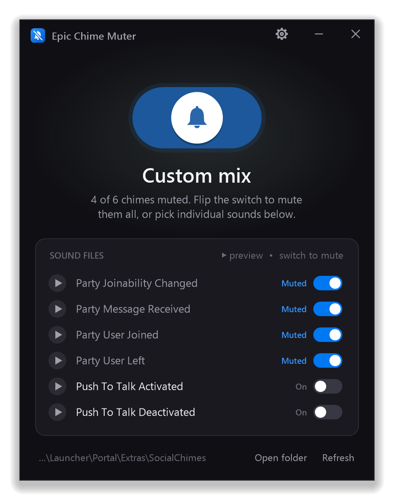
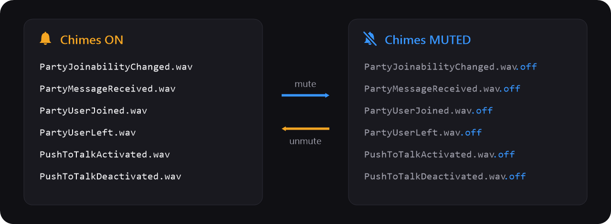
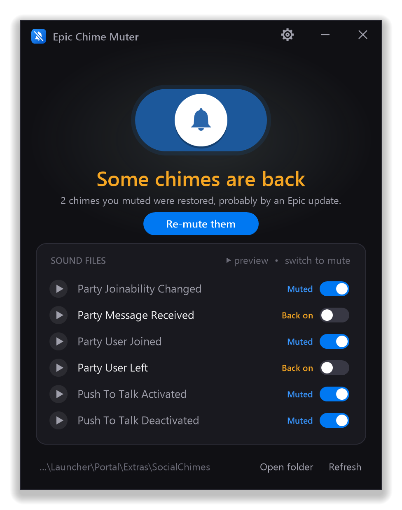
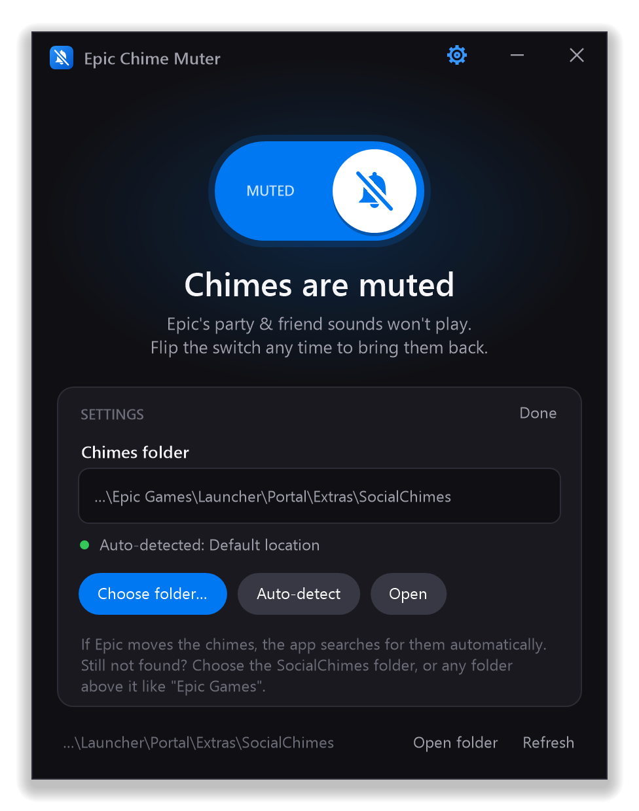

<p align="center">
  
</p>

<p align="center">
  <a href="https://github.com/Jayconius/Epic-Chime-Muter/releases/latest/download/EpicChimeMuter.exe"></a>
</p>
<p align="center">
  
  
  
  
</p>

---

## What is this?

The **Friends / Party update** for the Epic Games Launcher added **social chimes**: "ba-bing" sounds that play when someone joins or leaves your party, sends a party message, changes party joinability, or toggles push-to-talk. They also play while the launcher sits in the background, often while you're playing something else.

**Right now the Epic Games Launcher has no setting to turn them off.**

**Epic Chime Muter** is a small one-click app that turns them off (and back on).

> [!NOTE]
> **This is a temporary fix.** Epic has said it's working on a proper setting for the chimes. Once the launcher has a built-in toggle, use that instead and you won't need this app anymore.

## Screenshots

<p align="center">
  
  
</p>

## How to use

1. **[Download `EpicChimeMuter.exe`](https://github.com/Jayconius/Epic-Chime-Muter/releases/latest/download/EpicChimeMuter.exe)** from the latest release.
2. Run it and click **Yes** on the Windows admin prompt *(why? see the FAQ)*.
3. Flip the switch. **Done.** The chimes are muted.

Flip it again any time to bring them back. Nothing is deleted.

### Only want to mute some of them?

Each sound has its own switch. For example, you can mute the party join/leave/message chimes but keep the push-to-talk beeps. Click **▶** next to a sound to hear it first.

<p align="center">
  
</p>

Your choices are remembered, so if an Epic update brings a sound back, the app knows which ones you wanted muted.

## How it works

The chimes are six `.wav` files in:

```
C:\Program Files\Epic Games\Launcher\Portal\Extras\SocialChimes
```

Epic Chime Muter adds `.off` to the end of each file name so the launcher can't find them. Unmuting removes the `.off` again.

<p align="center">
  
</p>

| Sound file | When it plays |
| --- | --- |
| `PartyJoinabilityChanged.wav` | Party privacy / joinability changes |
| `PartyMessageReceived.wav` | Someone sends a party chat message |
| `PartyUserJoined.wav` | Someone joins your party |
| `PartyUserLeft.wav` | Someone leaves your party |
| `PushToTalkActivated.wav` | Push-to-talk turned on |
| `PushToTalkDeactivated.wav` | Push-to-talk turned off |

### Chimes came back after an Epic update?

Launcher updates can restore the original files. Just open Epic Chime Muter again. It detects the sounds you had muted that are playing again, marks them **Back on**, and shows a **Re-mute them** button that restores your exact setup.

<p align="center">
  
</p>

## FAQ

**Why does it need admin rights?**<br>
The chime files are in `Program Files`, and Windows only lets administrators rename files there. The app doesn't change anything else.

**Windows SmartScreen says "Windows protected your PC".**<br>
The app isn't code-signed (signing certificates are expensive for a free tool). Click **More info → Run anyway**. The full source is in this repo, and you can build it yourself (see below).

**Is this safe? Will it break the launcher or get me banned?**<br>
It only renames six sound files. It doesn't touch Fortnite, your games, or anything Epic's anti-cheat looks at. The launcher just stays quiet when a party event happens.

**My launcher is installed somewhere else, or Epic moved the chimes folder.**<br>
The app finds the folder automatically. It checks, in order:

1. a folder you picked yourself
2. the default location in `Program Files` / `Program Files (x86)`
3. where Windows says the Epic Games Launcher is installed
4. where the running launcher is
5. a search through the launcher's folders for the chime files

If it still can't find them, open **⚙ Settings** (top right) and click **Choose folder…**. You can pick the `SocialChimes` folder itself, or any folder above it (like `Epic Games`), and the app will search inside it. It remembers your choice, and **Auto-detect** switches back to automatic.

<p align="center">
  
</p>

**Keyboard shortcuts?**<br>
`Space` / `Enter` toggles all chimes, `F5` refreshes, and `Esc` closes settings or the app.

**Where are my settings stored?**<br>
In `%AppData%\EpicChimeMuter\settings.ini`, which holds your picked folder and which chimes you muted. Delete it to reset.

## Build from source

No Visual Studio or .NET SDK needed. It builds with the C# compiler that comes with Windows.

```powershell
git clone https://github.com/Jayconius/Epic-Chime-Muter.git
cd Epic-Chime-Muter
powershell -ExecutionPolicy Bypass -File build.ps1
```

The script runs the logic tests, renders the icon and README graphics, and writes `dist\EpicChimeMuter.exe`.

---

<sub>Not affiliated with, endorsed by, or sponsored by Epic Games, Inc. "Epic Games", "Epic Games Launcher" and "Fortnite" are trademarks of Epic Games, Inc. Released under the MIT License.</sub>
